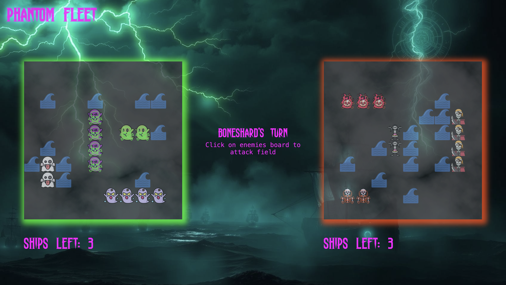

# Phantom Fleet  
**A Haunting Twist on Naval Warfare**  

  

## Table of Contents
- [About](#about)
- [Key Features](#key-features)
- [Game Modes](#game-modes)
- [Technical Details](#technical-details)
- [Installation](#installation)
- [Development Philosophy](#development-philosophy)

## About
Originally inspired by [The Odin Project's Battleship assignment](https://www.theodinproject.com/lessons/node-path-javascript-battleship), *Phantom Fleet* transforms the classic game into a supernatural naval battle with three hauntingly beautiful themes.

## Key Features

### Unique Enemy Fleets
- **Ghost Fleet** - Ghost Crew 
- **Undead Armada** - Zombie Crew
- **Bone Fleet** - Skeleton Crew 
- **Human Fleet** - Traditional pirate ships 

### Immersive Atmosphere
- Fully themed UI for each faction  
- Dynamic color schemes that change with your opponent  
- Haunting taunts from AI captains during gameplay 
- Visual ship damage that matches faction style  

## Game Modes

### Singleplayer Campaign
| Captain     | Difficulty |
|-------------|------------|
| Wraithmoor  | Easy       | 
| Grimhollow  | Medium     |
| Boneshard   | Hard       |

### Multiplayer Duel
- Choose from 4 unique factions  
- Local pass-and-play implementation  
- Same classic Battleship rules

## Technical Details

**Core Stack**  
- Vanilla JavaScript (ES6+ modules)  
- HTML5 Canvas for dynamic effects  
- CSS3 with custom properties  
- Webpack for bundling 

## Installation

# Clone repository
git clone https://github.com/yourusername/phantom-fleet.git

# Install dependencies
npm install

# Start development server
npm run dev

## Development Philosophy
- Clean First - Readable over clever
- Modular Design - Isolated components
- Test Driven - Validate core systems
- Theme Consistent - Reinforce the setting

"The fog carries both ship and sailor to their doom..." - Captain Wraithmoor